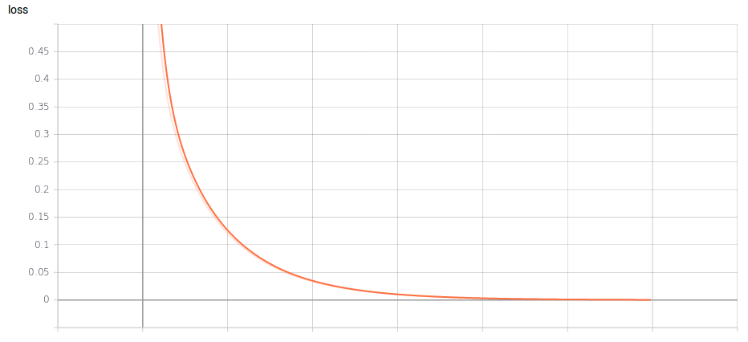
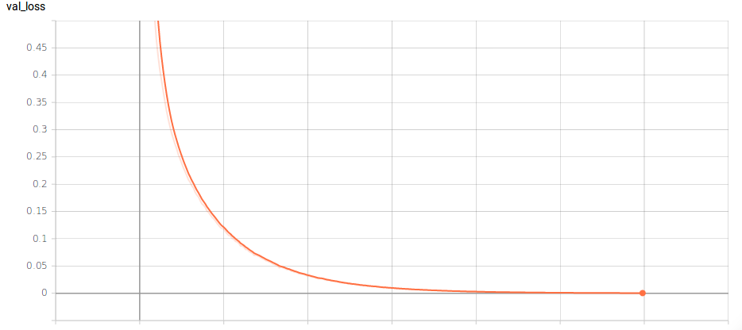
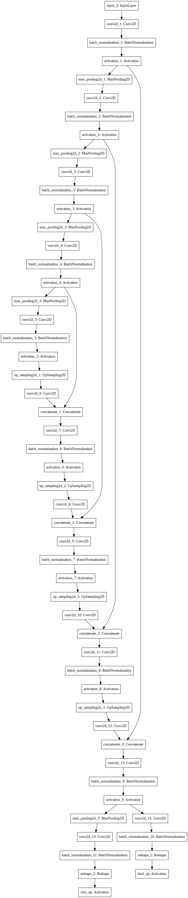

# Jigsaw-Net

Solving jigsaw puzzles with deep CNN's .

A **jigsaw puzzle** is a tiling puzzle that requires the assembly of often oddly shaped interlocking and tessellating pieces. Each piece usually has a small part of a picture on it; when complete, a jigsaw puzzle produces a complete picture.

**Problem statement**: Given an source image of size **NxN** and shuffled image with block size of **BxB**, our aim is to unscramble the shuffled jigsaw image to produce the original image.Here we limit ourselves to **square shaped images** where the tessellating pieces have *equal height and width*.The blocks should be square shaped and can have *four* possible orientations i.e rotations in degrees - **{90,180,270,360}**.

A **direct permutation** based approach to solve the puzzle will require an algorithm with **exponential time complexity**.Here we use a **simple encoder-decoder based CNN with two heads for block suffling and block rotations** respectively, for solving the jigsaw puzzle in real-time.

You may run the entire training, testing and data preparartion in Google Colaboratory with the IPython notebook.

**N.B: Install the correct version of keras to train the network. Also ensure sufficient ram is available, since we will be loading our full data-set into memory(currently) at the start of training.**

## Dependencies

* Python3
* PIL, matplotlib
* Scipy, skimage
* Tensorflow
* Keras 2.2.2

## Prerequisites

* Keras installation (TF backend)
* GPU with CUDA support
```
pip install keras==2.2.2
```
## Demo

### How to run

```python
python data.py # Prepare the dataset
python train.py # Train the network
python infer.py # Perform inference
```

### Training Graphs




### Network



### Sample Input


### Sample Output


## Versioning

Version 1.0

## Authors

Anil Sathyan

## Acknowledgments
* "https://keras.io/"
* "https://www.tensorflow.org/"
* "https://stackoverflow.com/"
